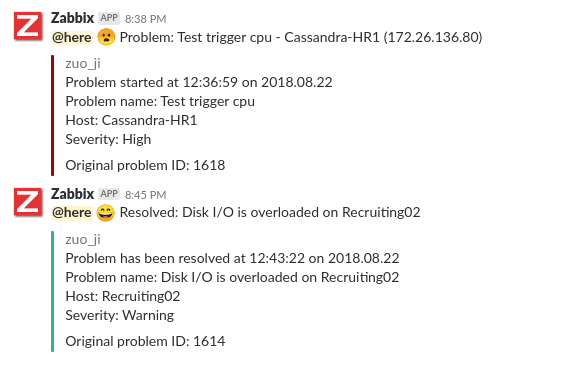
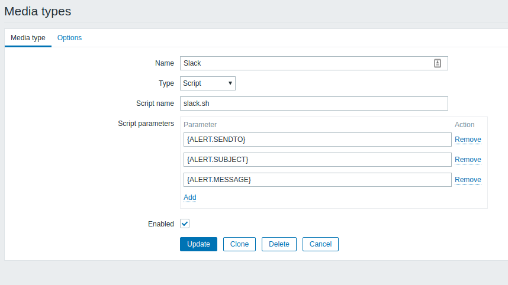
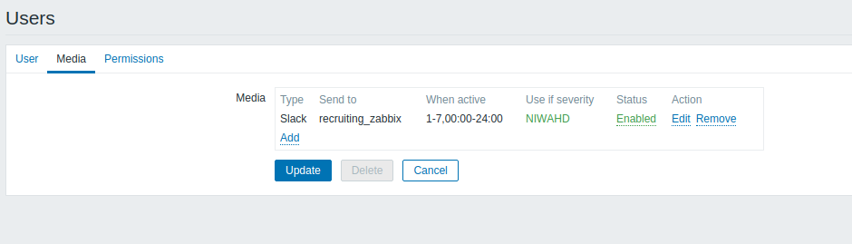

# zabbix-script
Inlude some script used in zabbix

## Slack Alert 


### About

This is simply a Bash script that uses the custom alert script functionality within Zabbix along with the incoming web-hook feature of Slack.

### How to use it 

1. Update the script`src/slack.sh` with your parameter,you can test it via run this script.
```shell
./slack.sh recruiting_zabbix Problem:Disk I/O is overloaded on Recruiting02 "Problem has been resolved at 12:43:22 on 2018.08.22\n \
Problem name: Disk I/O is overloaded on Recruiting02 \
Host: Recruiting02 \
Severity: Warning"
```
2. Copy`src/slack.sh` to your AlertScriptsPath directory that is specified within the Zabbix servers' configuration file (zabbix_server.conf) and must be executable by the user running the zabbix_server binary (usually "zabbix") on the Zabbix server:
```shell
[root@zabbix ~]# grep AlertScriptsPath /etc/zabbix/zabbix_server.conf
### Option: AlertScriptsPath
AlertScriptsPath=/usr/local/share/zabbix/alertscripts

[root@zabbix ~]# ls -lh /usr/local/share/zabbix/alertscripts/slack.sh
-rwxr-xr-x 1 root root 1.4K Dec 27 13:48 /usr/local/share/zabbix/alertscripts/slack.sh
```
3. Create a media type as follows:



Add 3 new parameters

```
{ALERT.SENDTO}
{ALERT.SUBJECT}
{ALERT.MESSAGE}
```

4. Update your user to receive new media type.



## reference

- [Slack Message Formatting](https://api.slack.com/docs/message-formatting)
- [Slack Webhook](https://api.slack.com/incoming-webhooks)